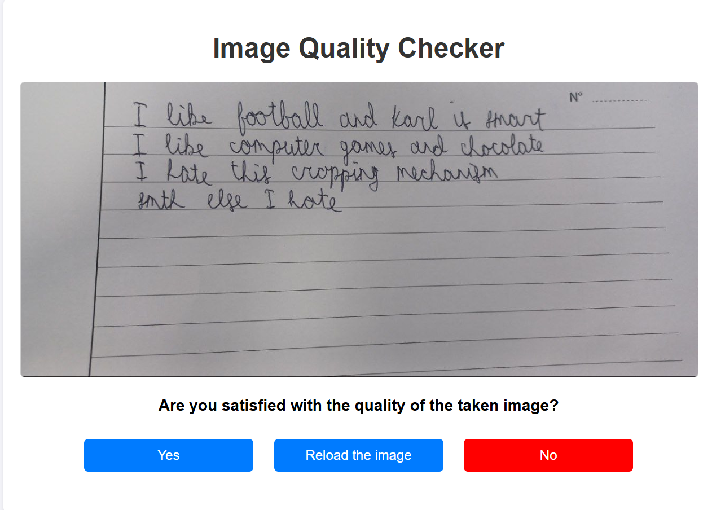
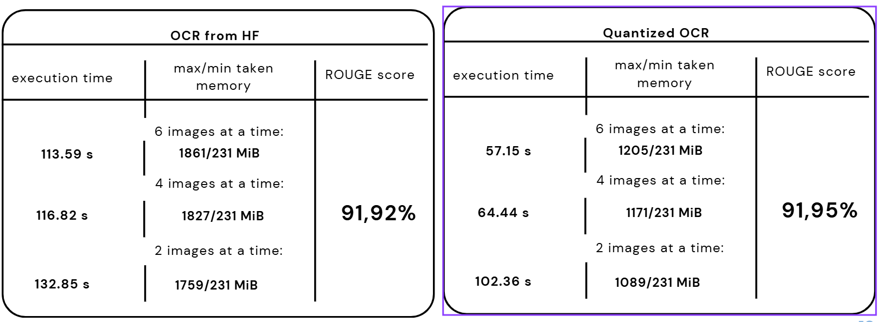
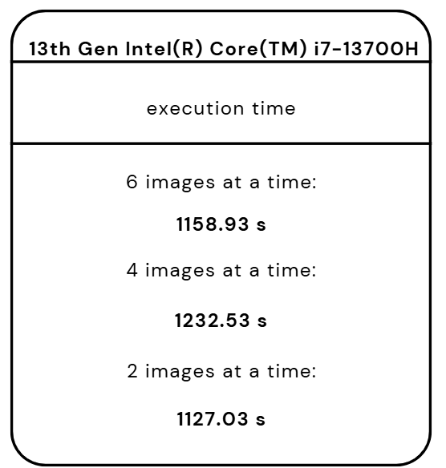
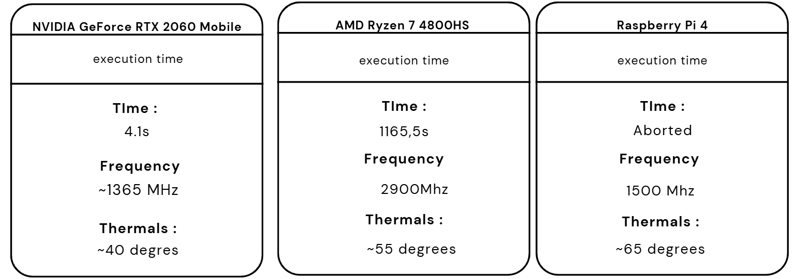

To check the embedded working project go to the ``iot-raspberry`` branch

# Handwriting correction assistance for teachers

BERDNYK Mariia - IA/ID

## Environment set-up

Install requirements listed in `Pipfile` file. Using a python environment manager is strongly recommended.

Example of `Pipenv` environment setup:

```shell
pipenv install
```

Example of Anaconda environment setup (Recommended for GPU user):

1. 
```shell
conda create -n teacher-assistance python=3.10
```
2. 
```
The following NEW packages will be INSTALLED:
Proceed ([y]/n)? y
```
3. 
```shell
conda activate teacher-assistance
```
4. (Optional) for Cuda > 11.8 on Windows:
```shell
pip install torch torchvision torchaudio --index-url https://download.pytorch.org/whl/cu118
```
5.
```shell
pip install -e .
```

2) Enter the environment for executing scripts correctly : 
```shell
pipenv shell
```

## Install Spell Checker model

1) Run script to download the model locally :
```shell
py .\ai_components\download_spell_checker_model.py
```

It will add a folder in create the folder `models\t5_base_spellchecker_model` which contains the Spell Checker model

2) Try the Check speller
```shell
py .\ai_components\spell_checker.py
```

## General use 

``python server.py`` will open the localserver, where the full loop can be executed and witnessed.
At any time, you can replace the ``uploaded_image.jpg`` (*WITH THE SAME NAME*) in the ``front/static/images`` folder and reload the image in the ``server.py``.



## Benchmarking

## OCR model benchmark:
(.txt files are located in ``benchmarks/benchmark_ocr``)







## Spell Checker Benchmark:
### T5 Spell Checker:
  Average Time: 3.8025 seconds \
  Min Time: 0.4341 seconds \
  Max Time: 31.5263 seconds \
  Average ROUGE-L Score: 0.7683 

### Bart Spell Checker:
  Average Time: 3.2829 seconds \
  Min Time: 0.8637 seconds \
  Max Time: 23.9916 seconds \
  Average ROUGE-L Score: 0.9160 

### Autocorrect Spell Checker (selected):
  Average Time: 0.0011 seconds \
  Min Time: 0.0000 seconds \
  Max Time: 0.0020 seconds \
  Average ROUGE-L Score: 0.8933 

## Grammar Checker Benchmark:
### T5 Grammar Checker (selected):
  Average Time: 3.1501 seconds \
  Min Time: 0.4146 seconds \
  Max Time: 25.4689 seconds \
  Average ROUGE-L Score: 0.9875 

### Grammar Synthesis Small:
  Average Time: 1.7816 seconds \
  Min Time: 0.5774 seconds \
  Max Time: 11.3091 seconds \
  Average ROUGE-L Score: 0.7732 
